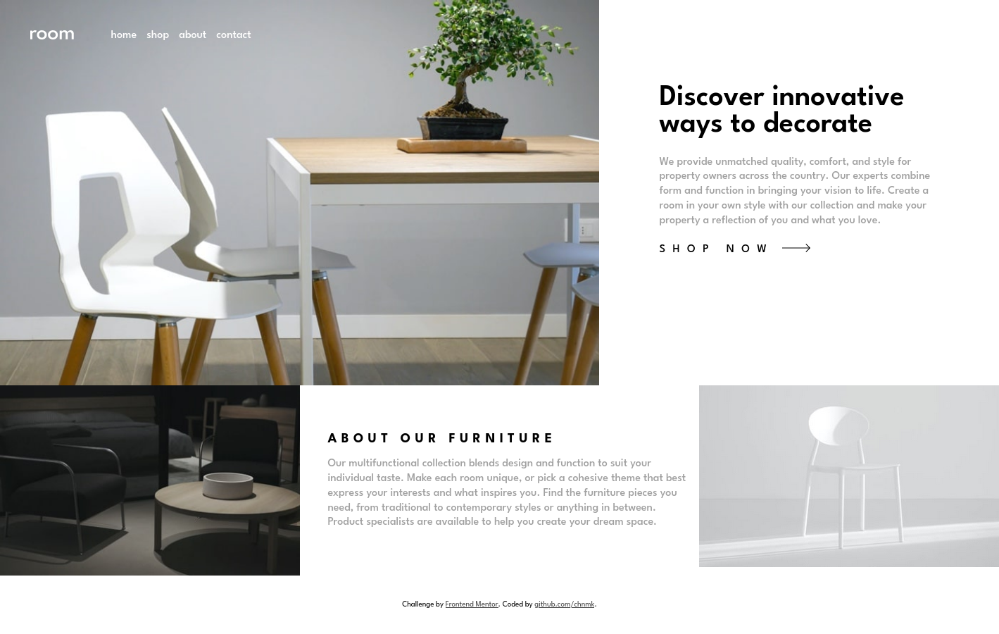

# Frontend Mentor - Room homepage solution

This is a solution to the [Room homepage challenge on Frontend Mentor](https://www.frontendmentor.io/challenges/room-homepage-BtdBY_ENq). Frontend Mentor challenges help you improve your coding skills by building realistic projects. 

## The challenge

Users should be able to:

- View the optimal layout for the site depending on their device's screen size
- See hover states for all interactive elements on the page
- Navigate the slider using either their mouse/trackpad or keyboard

### Screenshot (13-12-2023)

### Links

- Solution URL (*TODO: update link): [Vercel deployment](https://room-homepage-git-main-chnmks-projects.vercel.app/)

### Built with

- Webpack
- Grid
- SCSS
- BEM

### TODO

* Add navigation
* Mobile layout